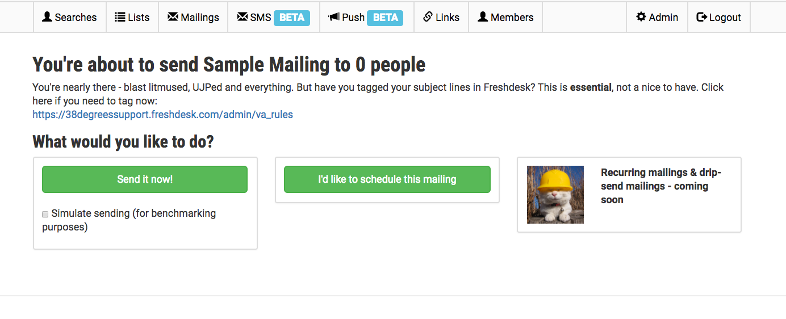

# Using Identity

For the reader: this document is for you if you are a non-developer managing
Identity, or a developer playing an administrative role. This is not technical
documentation, but user documentation, beginning with your first login, covering
user imports, setting up journeys, and sending your first mailing.

### Getting Started

Your first interaction with Identity will be that you'll receive an email
letting you know that your developer has just added you as an admin on Identity.

{:class="img-fluid border col-md-8 col-lg-6"}

So you click, and you enter your email address, and you get another email with a second link where you complete your registration by setting up a password:

{:class="img-fluid border col-md-8 col-lg-6"}

Enter your phone number to complete the 2-factor authentication, and you're in!

{:class="img-fluid border col-md-8 col-lg-6"}

### Adding Campaigner Accounts

Once you're in, you'll need to create logins for the other Campaigners using the tool. You can do this under Admin > Administrators. The campaigners will receive the same sort of email/confirmation messages.

### Build a mailing

Click the "Mailings" link.

{:class="img-fluid border col-md-8 col-lg-6"}

To create a new email, you really only have this one screen to worry about:

{:class="img-fluid border col-md-8 col-lg-6"}

This screen does need you to have already built the list you'll be sending to. (See below for that.) But once you're here it's quite simple. You just have the field in front of you, and these helpful tabs on the right for more complex behavior.

#### A/B test your message

You can easily set up A/B tests on the right, just like this:

{:class="img-fluid border"}

You can use any merge tag that's not already taken. e.g. `{ask_text}` or `{banner_image}`.

#### Mail-merge a custom dataset

Under `Mailings > Datasets`, you can upload custom data to associated with individual members or constituencies (or districts, ridings, electorates, Members of Parliament, Members of Congress). Try it out with custom ask-amounts for a donation request, or the location of a member's closest house party, or the positions taken by different MPs on a certain campaign.

{:class="img-fluid border col-md-8 col-lg-6"}

Then you can access this data in your mailings just like this:

<< get the screenshot >>

#### Preview the mailing

By clicking "Preview" on the right, you can view a preview right in the window, and check out what you would see if you were a specific member or from a specific constituency.

{:class="img-fluid border col-md-8 col-lg-6"}

#### Send a proof

And of course, you can always send yourself a proof.

{:class="img-fluid border col-md-8 col-lg-6"}

Note: There's a checkbox here to send a sample of each and every test variation. (If you have 3 tests with 4 test cases each, that's 64 emails!)

#### Schedule email, or drip

You can choose to send or schedule the mailing. Or (coming soon!) use the "drip" feature.

{:class="img-fluid border col-md-8 col-lg-6"}
